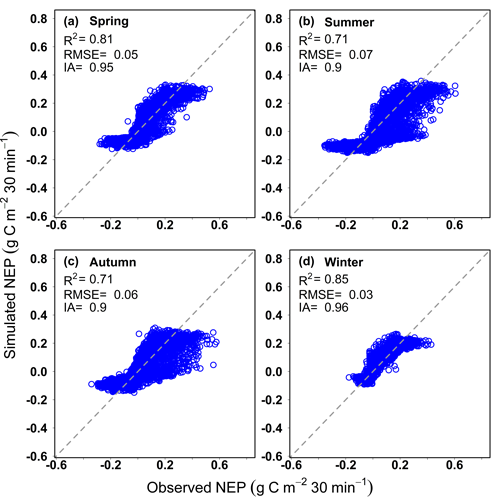

```{r, include = FALSE}
knitr::opts_chunk$set(
  collapse = TRUE,
  comment = "#>"
)
```

## Abstract
This vignette provides an overview of the `rTRIPLEXCWFlux` R package functions. We provide a working examples to demonstrates the basic functionality and use of the package.


## Purpose
The `rTRIPLEXCWFlux` package encodes the carbon uptake submodule and evapotranspiration submodule of the `TRIPLEX-CW-Flux` model to run the simulation of carbon-water coupling. `TRIPLEX-CW-Flux` model is based on two well-established models, `TRIPLEX-Flux` model ([Zhou et al., 2008](https://doi.org/10.1016/j.ecolmodel.2008.07.011)) and `Penman–Monteith` model ([Monteith, 1965](https://www.semanticscholar.org/paper/Evaporation-and-environment.-Monteith/428f880c29b7af69e305a2bf73e425dfb9d14ec8)). In the R script, the user only needs to download and load the `rTRIPLEX-CW-Flux` package, and then input the variables and parameters of the model to obtain simulated results. This package accelerates the running speed of the model and facilitates the estimation of carbon sequestration and water consumption in different forest ecosystems using extensive flux observed data.This could make `TRIPLEX-CW-Flux` model free available and more popular in future study.

## Model run
To display the basic functionality of `rTRIPLEXCWFlux` R package, a simple simulation will be performed using TRIPLEX-CW-Flux model. The function of run TRIPLEX-CW-Flux model from R is `TRIPLEX_CW_Flux`. After called, the function will run and return the simulated results and charts for NEP and ET at 30 min scale, and monthly variation of the input environmental factors.

Before running the `rTRIPLEXCWFlux` R package, users need to prepare the input variables and parameters required by the model, and check whether the column name is consistent with that in internal data in advance. You can use `data("Inputpara")` and `data("Inputvariable")` to see the information and format of input variables and parameters tables, respectively.

In this example, we run a simulation for a Chinese fir plantation. The input data are provided as internal data in `rTRIPLEXCWFlux`.

```{r,eval=FALSE}
library(rTRIPLEXCWFlux)
out<-TRIPLEX_CW_Flux (Input_variable=Inputvariable,
                 Input_parameter=Inputpara,
                 overyear = TRUE)
head(out)
```
`overyear=TRUE` means that the input data is more than one year. if `overyear=TRUE`, The outputs of the `TRIPLEX_CW_Flux` function are a long format dataframe and charts of simulated result for net ecosystem productivity (NEP) and evapotranspiration (ET) at 30 min scale, and monthly variation of the input environmental factors. The first 18 columns of the dataframe are input variables. The column names, definition for the table of input variables is described in `Inputvariable.R`. Using `data(Inputvariable)` can load the table. The nineteenth and twentieth columns are season and the number of seasons. The twenty-first and twenty-second columns are the observed NEP and ET after the conversion unit. The twenty-third column is the simulated net ecosystem productivity, the twenty-fourth column is the simulated ET, the twenty-fifth column is the estimated gross ecosystem productivity, and the twenty-sixth column is the estimated ecosystem respiration.
<br/>
**i. the graph of Simulated ET results at 30 min scale in four seasons.**
```{r,echo=FALSE,out.width ="60%",fig.align = 'center'}
knitr::include_graphics("../man/Figures/ET_seasonal19.png")
```
<br/>
**ii. the graph of Simulated NEP results at 30 min scale in four seasons.**
```{r,echo=FALSE,out.width="60%",fig.align = 'center'}

```
<br/>
**iii. the graph of Simulated NEP and ET at 30 min scale during whole studied period.**
```{r,echo=FALSE,out.width="60%",fig.align = 'center'}

```
<br/>
**iv. the graph of diurnal dynamics for observed and simulated NEP at 30 min scale during whole studied period.**
```{r,echo=FALSE,out.width="80%",fig.align = 'center'}

```
<br/>
**v. the graph of diurnal dynamics for observed and simulated ET at 30 min scale during whole studied period.**
```{r,echo=FALSE,out.width="80%",fig.align = 'center'}

```
<br/>
**vi. the graph of environmental factors during whole studied period.**
```{r,echo=FALSE,out.width="60%",fig.align = 'center'}

```

## Reference
  Evaporation and Environment. Symposia of the Society for Experimental Biology, 19, 205-234. [https://www.semanticscholar.org/paper/Evaporation-and-environment.-Monteith](https://www.semanticscholar.org/paper/Evaporation-and-environment.-Monteith/428f880c29b7af69e305a2bf73e425dfb9d14ec8)

  Zhou, X.L., Peng, C.H., Dang, Q.L., Sun, J.F., Wu, H.B., &Hua, D. (2008). Simulating carbon exchange in Canadian Boreal forests: I. Model structure, validation, and sensitivity analysis. Ecological Modelling,219(3-4), 287-299. [https://doi.org/10.1016/j.ecolmodel.2008.07.011](https://doi.org/10.1016/j.ecolmodel.2008.07.011)
